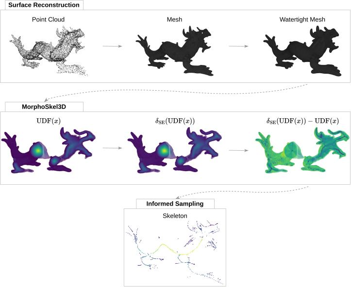

# MorphoSkel3D: Morphological Skeletonization of 3D Point Clouds

The official repository of the 3DV 2025 paper: "MorphoSkel3D: Morphological Skeletonization of 3D Point Clouds for Informed Sampling in Object Classification and Retrieval". 

<p align="center">
  
</p>


### Quick  Start
To clone the repository with its submodule, run the following:
```
git clone --recursive https://github.com/Pierreoo/MorphoSkel3D.git
```

## Datasets
The skeletal representations generated by MorphoSkel3D (MS3D) from the surface point clouds are available for download via the following Google Drive link: [MS3D dataset](https://drive.google.com/drive/folders/1n7AdNwgjQS8XOvmVVuXuVT2pQybz3RXr?usp=sharing).
A compressed folder is provided for ShapeNet and ModelNet to include the surface, mesh, and skeletal data. 
To use the datasets for training and evaluation, simply unzip the folder and place the contents under the `data/` directory.

To create a skeletonized dataset of ModelNet or ShapeNet from scratch, please follow to the instructions below. Ensure that the directory paths specified in `utils/path.py` align with the desired configuration.

### ShapeNet
The same subset of the ShapeNet dataset used in the Point2Skeleton benchmark is employed. Each category, defined within the `__main__` function, can be processed to become watertight and skeletonized by the following command:
```
python evaluation/shapenet_time.py
```

### ModelNet
The normalized and resampled ModelNet40 dataset can be skeletonized with a specified configuration in the `__main__` function:
```
python method/modelnet_MS3D.py
```

## Experiments
With the datasets in place, the experiments of MS3D can be reproduced by running the following scripts. 
The pre-trained models for the four sampling ratios are also available via the Google Drive link: [MS3D models](https://drive.google.com/drive/folders/1n7AdNwgjQS8XOvmVVuXuVT2pQybz3RXr?usp=sharing).
Unzip the log folder and place the models under the `Skeleton-Aware-Sampling/sampling/log` directory.

### Skeletal Extraction
To evaluate the skeletal performance on the ShapeNet subset, the reconstruction error for a specific category can be calculated with:
```
python evaluation/shapenet_recon.py
```

### Object Classification
The pre-trained classification network that is optimized for inputs of 1024 surface points could be found under `Skeleton-Aware-Sampling/classification/log`.

To further test its robustness against lower point cloud densities, the pre-trained sampling models of MS3D for the four different sampling ratios are evaluated.

The classification accuracy of for each sampling ratio can be tested using the following example:
```
cd Skeleton-Aware-Sampling
python classifi.py --test --ratio 64
```

### Point Cloud Retrieval
The precision for this downstream task can be assessed with the following command:
```
cd Skeleton-Aware-Sampling
python retrieval.py --ratio 64
```


## Citation
If you find our work useful in your research, please consider citing:
```
@INPROCEEDINGS{11125643,
  author={Onghena, Pierre and Velasco-Forero, Santiago and Marcotegui, Beatriz},
  booktitle={2025 International Conference on 3D Vision (3DV)}, 
  title={MorphoSkel3D: Morphological Skeletonization of 3D Point Clouds for Informed Sampling in Object Classification and Retrieval}, 
  year={2025},
  volume={},
  number={},
  pages={1350-1359},
  keywords={Point cloud compression;Geometry;Training;Solid modeling;Three-dimensional displays;Shape;Surface morphology;Sampling methods;Skeleton;Surface treatment},
  doi={10.1109/3DV66043.2025.00128}
}
```
